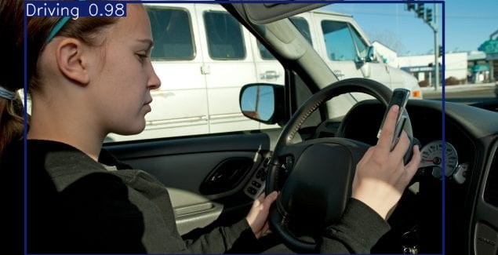
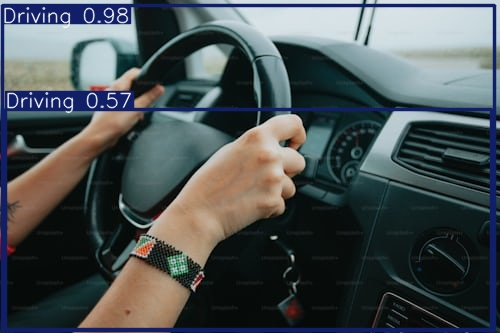
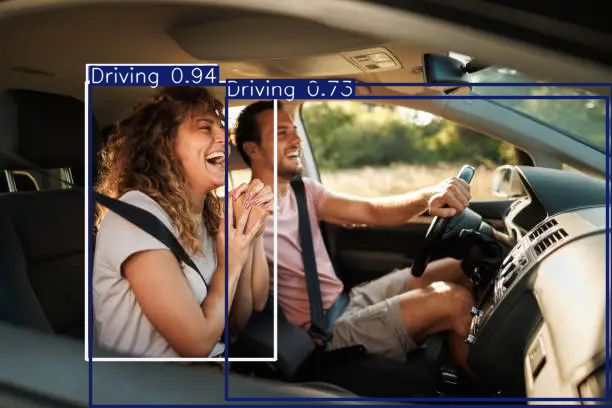
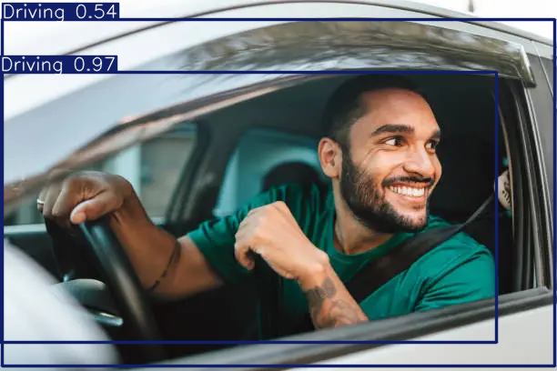
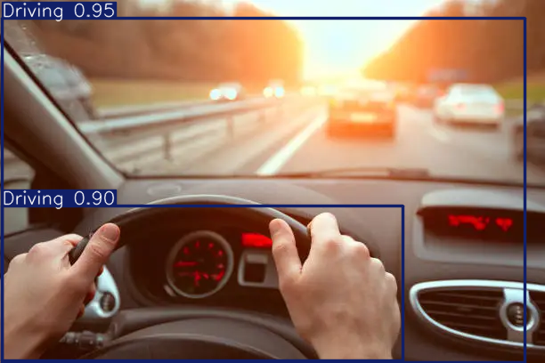

# Human Activity Model


## Project Overview

The **Human Activity Model** project aims to create an integrated system for object detection and human activity recognition, enhanced by voice output functionality. The system is designed to identify objects and analyze human activities in real time, providing interactive feedback that enhances accessibility, especially for individuals with visual impairments.

***
### Key Features:
1. **Object Detection**: 
   - Utilizes Convolutional Neural Networks (CNNs) to detect and classify objects within a visual scene in real time.
2. **Human Activity Recognition**: 
   - Employs Recurrent Neural Networks (RNNs) to classify activities such as walking, running, and sitting from video input.
3. **Voice Output**: 
   - Provides audible feedback of detected objects and activities, making it accessible for individuals with visual impairments.

### Purpose:
- Improve accessibility for people with visual impairments.
- Enhance user interaction in smart home environments.
- Provide real-time recognition tools for security and surveillance applications.

### Technologies Used:
- **Programming Language**: Python
- **Machine Learning Frameworks**: TensorFlow, Keras
- **Computer Vision Library**: OpenCV
- **Voice Output**: gTTS (Google Text-to-Speech)
- **Dataset Sources**: COCO (for object detection), UCF101 (for human activity recognition)

### Hardware Requirements:
- **CPU**: Minimum Dual-core (Intel i5 or equivalent)
- **GPU**: NVIDIA GTX 1050 or higher (Recommended: RTX 2060)
- **Camera**: HD webcam or external camera (720p resolution or higher)

### Software Requirements:
- **Operating System**: Windows, macOS, or Linux
- **Development Environment**: Anaconda/Miniconda for Python environment management
- **Libraries**: TensorFlow, Keras, OpenCV, gTTS

## How to Use:
1. Clone the repository:
   ```bash
   git clone https://github.com/Pradeep-1496/Human_Activity_Model.git
   ```
  

## Libraries Used & Installation

[cv2](https://pypi.org/project/opencv-python/)

```bash
pip install opencv-python
```
[ultralytics](https://pypi.org/project/ultralytics/)

```bash
pip install ultralytics
```
[pyttsx3](https://pypi.org/project/pyttsx3/)

```bash
pip install pip install pyttsx3
```
## ScreenShots of Output
<div align="center">
  
  
  
  
  
</div> 

